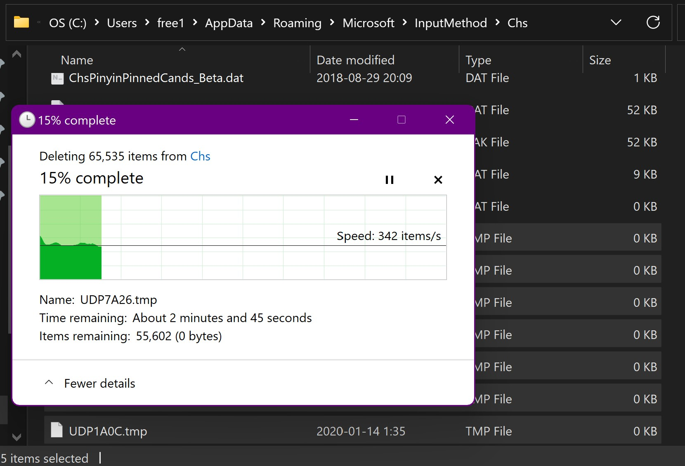

# Microsoft Pinyin Freezes When Switching From Other IMEs

__TL;DR: Delete all `UDP<4-digit-HEX>.tmp` in `~/AppData/Roaming/Microsoft/InputMethod/Chs`.__

Sometime last year, my laptop running the latest insider preview version of Windows started to have an issue with the Chinese IME. When I switch from other IMEs to Microsoft Pinyin and immediately start typing, the input hangs and the `ctfmon` process gets stuck in a single-thread loop. To avoid the issue, wait about 10 seconds before starting typing.

Initially I thought this might just be another bug in the preview versions. But now I have 2 devices running Windows 11, and only the laptop had this issue. So I decided to take a deeper look and see if I can fix it by resetting Microsoft Pinyin's settings.

As is the case with most proprietary software, locating Microsoft Pinyin's config directory involves blind searches for some random keywords in the whole user directory. Turns out it's not that deep and hidden: `~/AppData/Roaming/Microsoft/InputMethod/Chs`.

Upon entering the directory, the enormous amount of temporary files immediately caught my eyes. There are 65535 __empty__ temporary files with names `UDP<4-digit-HEX>.tmp`. This doesn't look right. On my other Windows device, the number of temporary files is ~1500.

I was right. Deleting these files did the trick. The bug only surfaced on a 2-year-old install. I can imagine the experience of those impacted by it, suffering from it, forced to do a clean install for it.

So what's next? I guess writing this blog post is all I can do. Unless someone who knows folks in the Pinyin IME team can inform them of the bug. Until then, just delete the files yourself, or stop using Windows!
